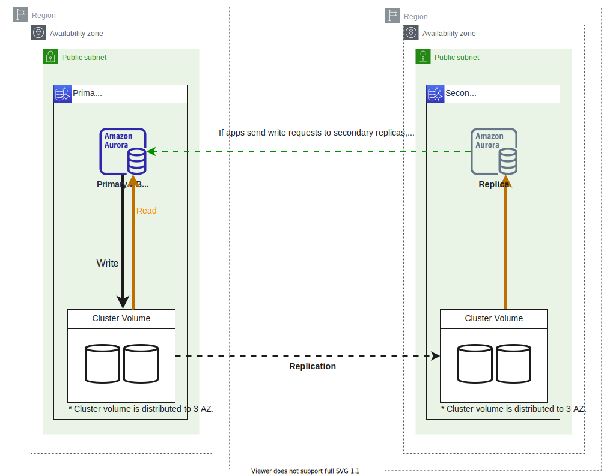
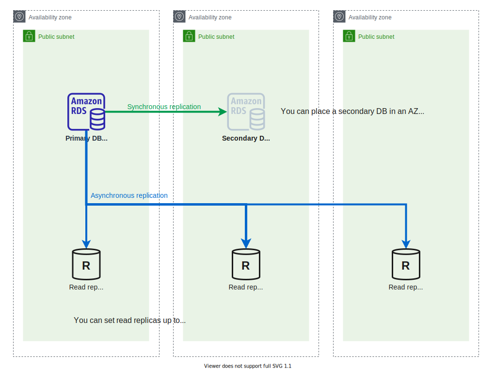
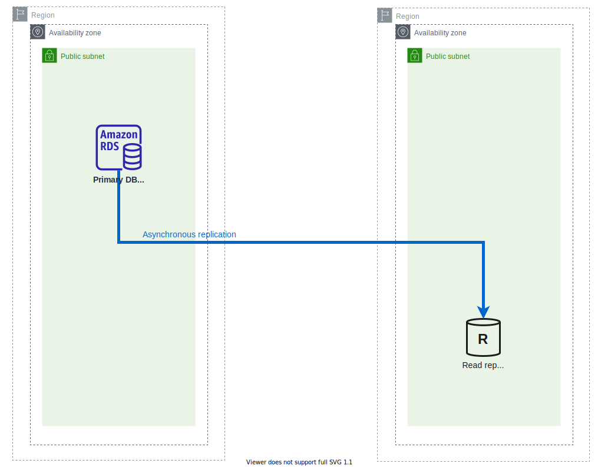
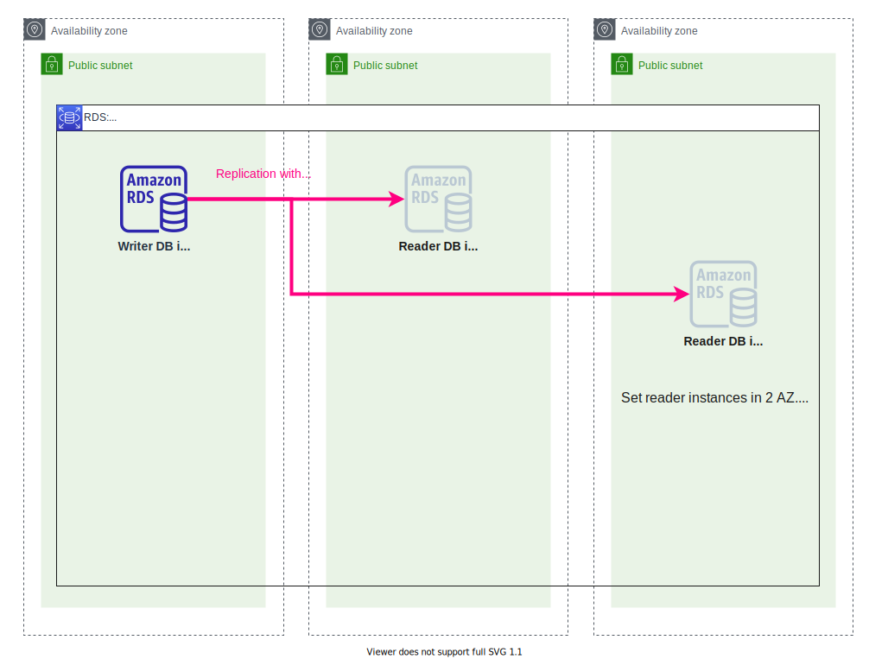

# terraform-example-rds
Minimum example of Amazon RDS.

⚠️ Under constructions

## Aurora
### Standard usage

- Single region
- Some read replicas (up to 15)

### Global database

- Multi region
- Global read replicas (up to 5)

## RDS other than Aurora
### Multi AZ + Read replicas

### Cross region replication

### Multi-AZ DB Cluster

