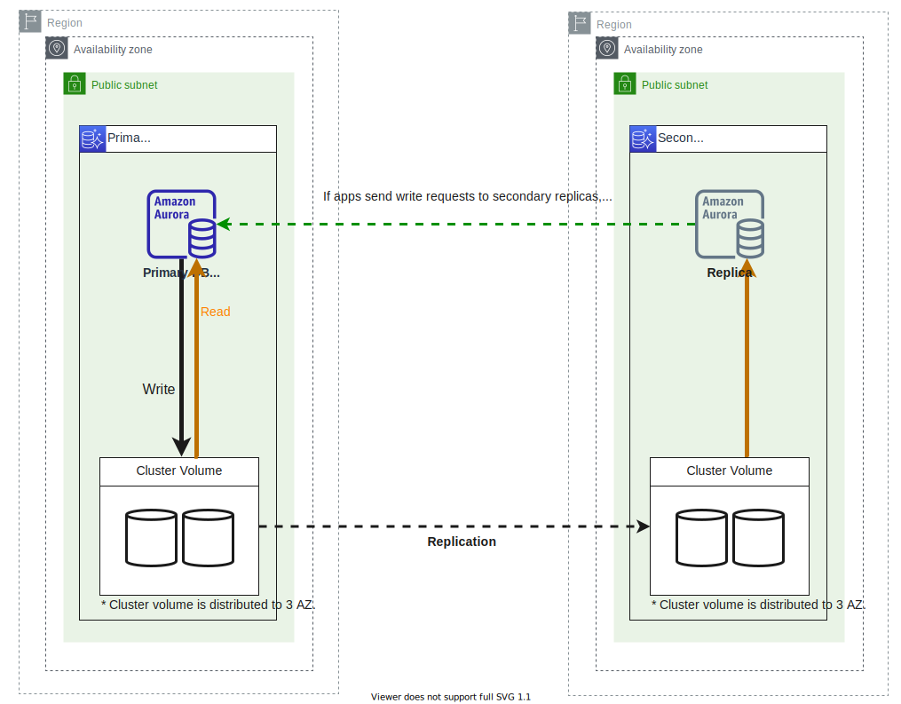

# terraform-example-rds
Minimum example of Amazon RDS.

⚠️ Under constructions

## 🚀 Aurora
### Provisioned instance

- Single region
- Some read replicas (up to 15)

### Serverless v2

- Single region
- A combination of serverless and provisioned options is also available

### Global database

- Multi region
- Global read replicas (up to 5)

## 🚀 RDS other than Aurora
### Multi AZ + Read replicas

### Cross region replication

### Multi-AZ DB Cluster

